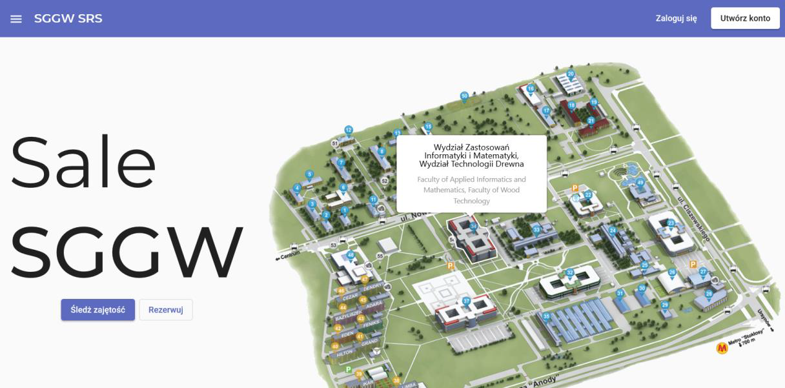
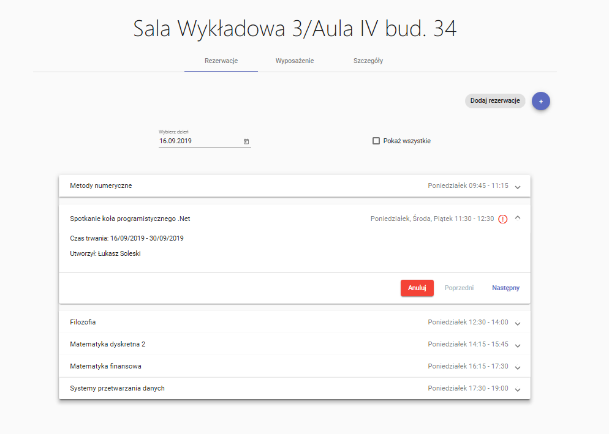
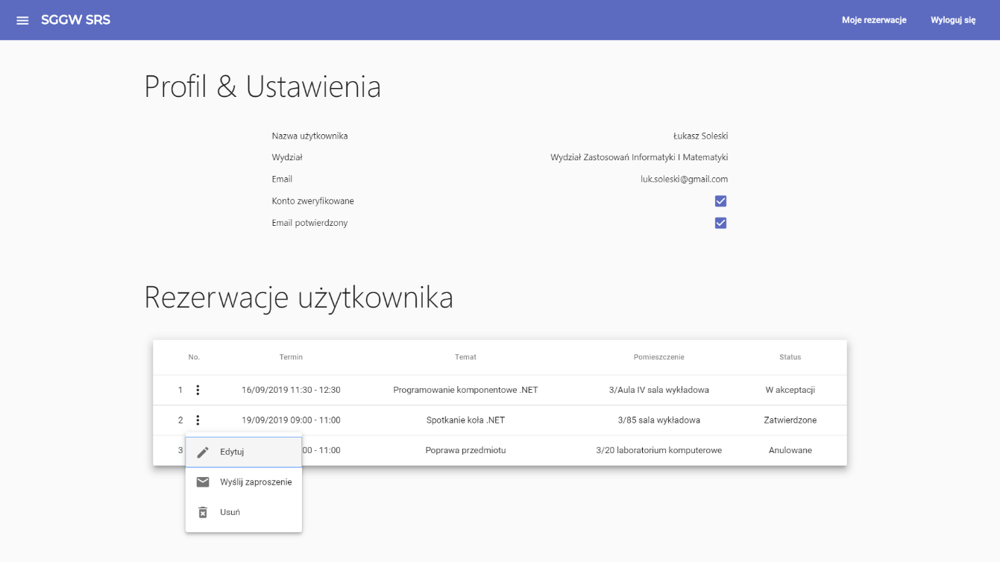
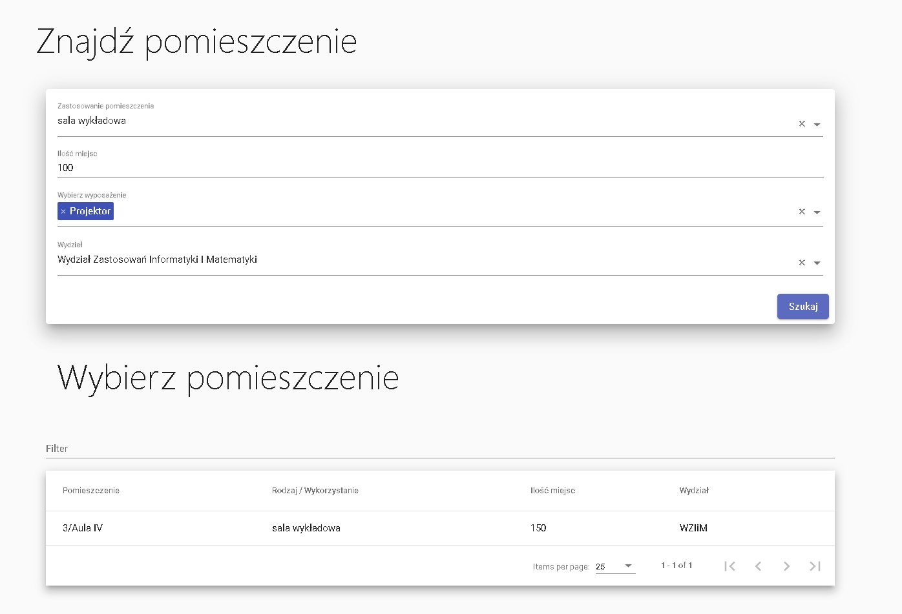
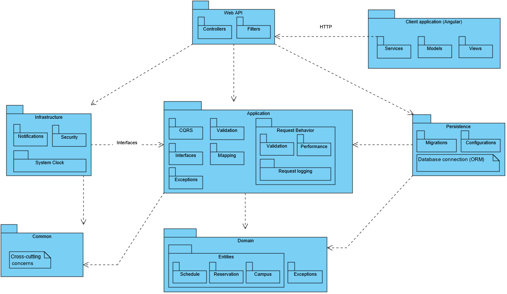
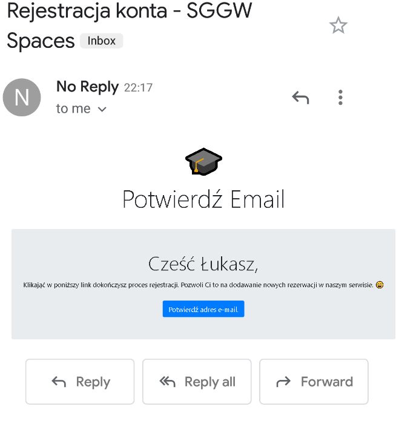

[![Contributors][contributors-shield]][contributors-url]
[![Forks][forks-shield]][forks-url]
[![Stargazers][stars-shield]][stars-url]
[![Issues][issues-shield]][issues-url]
[![MIT License][license-shield]][license-url]
[![LinkedIn][linkedin-shield]][linkedin-url]


# SGGW spaces
The aim of the project is to create an online reservation and occupancy system for the WULS - SGGW university. The application should include an overview of the premises and their search by use, equipment and number of places.

Users should be able to make quick reservations within the assigned department. Reservation of a room in another department may require approval, which the designated person, room manager or planner accepts or rejects, possibly through negotiations with the person booking the change of room or date.

The functionality of the system largely depends on the current schedule, therefore the system also requires import functions and integration with existing data.

### Built With

* [.Net Core](https://dotnet.microsoft.com/download)
* [Angular](https://angular.io/)
* [CQRS](https://www.youtube.com/watch?v=_lwCVE_XgqI&t=6s)
* [JWT](https://jwt.io/)
* [SendGrid](https://sendgrid.com/)


## Get started

In order to run this project, make sure you have intalled the latest versions of [nodeJS](https://nodejs.org/en/), [Angular CLI](https://angular.io/guide/setup-local) and 
[.Net Core SDK](https://dotnet.microsoft.com/download)

### Clone the repo

```shell
git clone https://github.com/lukaszsoleski/RoomOccupancy.git
```

### Install npm packages

Install the `npm` packages described in the `package.json`. 

```shell
cd RoomOccupancy/RoomOccupancy.API/AngularClient
npm install
```

### Run Angular client

```shell
npm serve -o
```

### Run .Net Core server

From the API folder 'RoomOccupancy/RoomOccupancy.API' run a following command:

```shell
dotnet run --urls=http://localhost:51583/
```

<p align="center">
  
  
  
  
  
  
</p>

<!-- MARKDOWN LINKS & IMAGES -->
<!-- https://www.markdownguide.org/basic-syntax/#reference-style-links -->
[contributors-shield]: https://img.shields.io/github/contributors/lukaszsoleski/sggw-spacessvg?style=flat-square
[contributors-url]: https://github.com/lukaszsoleski/sggw-spaces/graphs/contributors
[forks-shield]: https://img.shields.io/github/forks/lukaszsoleski/sggw-spaces.svg?style=flat-square
[forks-url]: https://github.com/lukaszsoleski/sggw-spaces/network/members
[stars-shield]: https://img.shields.io/github/stars/lukaszsoleski/sggw-spaces.svg?style=flat-square
[stars-url]: https://github.com/lukaszsoleski/sggw-spaces/stargazers
[issues-shield]: https://img.shields.io/github/issues/lukaszsoleski/sggw-spaces.svg?style=flat-square
[issues-url]: https://github.com/lukaszsoleski/sggw-spaces/issues
[license-shield]: https://img.shields.io/github/license/lukaszsoleski/sggw-spaces.svg?style=flat-square
[license-url]: https://github.com/lukaszsoleski/sggw-spaces/blob/master/LICENSE.txt
[linkedin-shield]: https://img.shields.io/badge/-LinkedIn-black.svg?style=flat-square&logo=linkedin&colorB=555
[linkedin-url]: https://www.linkedin.com/in/łukasz-soleski-22a724196/
[product-screenshot]: docs/home.png
